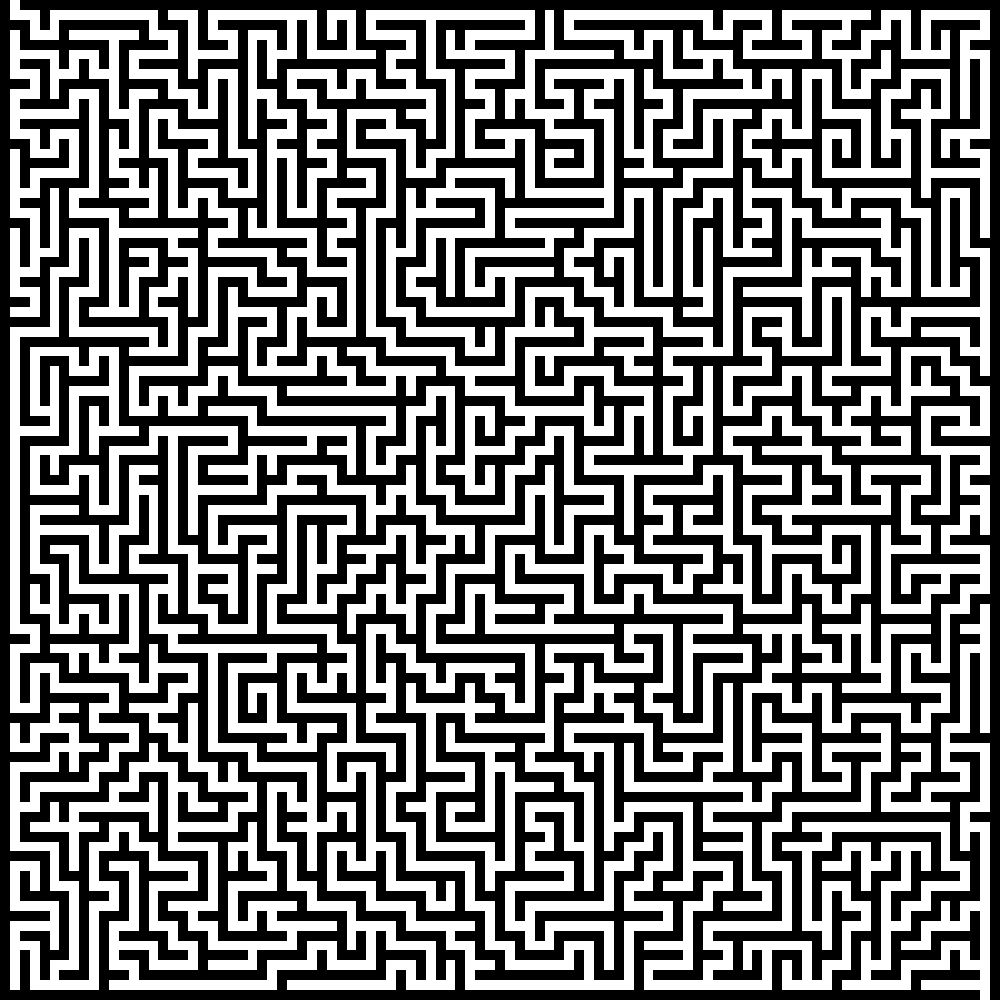

# Maze Generator

## Description

Uses depth first search to generate a maze

## Setup

    $ pip install -r requirements.txt

## Usage

    $ python maze.py -h
    usage: maze.py [-h] [--width WIDTH] [--height HEIGHT] [--filename FILENAME] [--scale SCALE]

    optional arguments:
      -h, --help           show this help message and exit
      --width WIDTH        The width of the maze (default 50)
      --height HEIGHT      The height of the maze (default 50)
      --filename FILENAME  The image filename where to save the result (default maze.png)
      --scale SCALE        The scale of the rendered image (default 100)
      
      
## Results

    $ python maze.py

